# scHopfield paper: figure guide

A navigable guide to every results section: the composed paper figure
(`../paper/figures/`), the underlying exploratory plots (`<section>/plots/`), and a
short explanation of each and what it means. Numbers come from the section JSONs;
findings are logged in [`FINDINGS.md`](FINDINGS.md). Three sections have their own
detailed guides, linked below.

| Section | Paper fig | Result dir | Detailed guide |
|---|---|---|---|
| 1. Model overview | `fig1`, `fig1_schematic` | — | — |
| 2. Synthetic circuit recovery + GENIE3 | `fig2`, `fig2b`, `supp_genie3` | `circuit_recovery/`, `grn_baseline/` | — |
| 3. Hill nonlinearity is necessary | `fig3` | `ablations/` | — |
| 4. Known-driver KO vs CellOracle | `fig4` | `hemato_ko/`, `nc_ko/` | — |
| 5. Robustness / network+reg sensitivity | `fig5`, `supp_sensitivity` | `network_reg_sensitivity/` | [guide](network_reg_sensitivity/FIGURE_GUIDE.md) |
| 6. Energy/stability + higher-order | `fig6` | `pancreas/`, `energy_stability/` | — |
| S. Reproducibility | `supp_repro` | `seed_sensitivity*/` | — |
| S. Identifiability | `supp_identifiability`, `supp_multi_ident` | `real_identifiability/` | — |
| S. Cross-dataset generalization | `supp_murine_energy` | `energy_stability/`, `nc_ko/` | — |
| Model: bias term (L1) | — | `bias_penalty/` | [guide](bias_penalty/BIAS_FIGURE_GUIDE.md) |
| Cross-dataset results (5 systems) | — | `cross_dataset/` | [guide](cross_dataset/CROSS_DATASET_FIGURE_GUIDE.md) |
| End-to-end pipeline | — | `pipeline/` | [guide](pipeline/README.md) |
| Honest negative: Jacobian reg | — | `jacobian_reg/` | — |

---

## 1. Model overview (Fig 1)

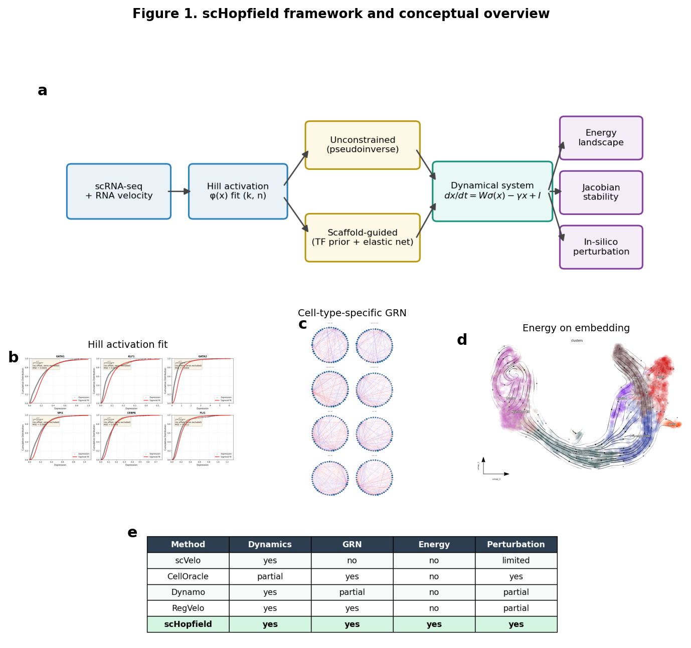

The composed schematic: the continuous-Hopfield model `dx/dt = W·σ(x) − γx + I`, the
fitted Hill activation, a cell-type GRN, the Lyapunov energy landscape, and the
comparison-to-prior-methods table. This is the conceptual figure; the panels are
validated quantitatively in the sections below.

---

## 2. Synthetic circuit recovery + GENIE3 (Fig 2)

**Question:** can scHopfield recover a known interaction matrix from
analytic-derivative data, and does it beat a standard GRN baseline?

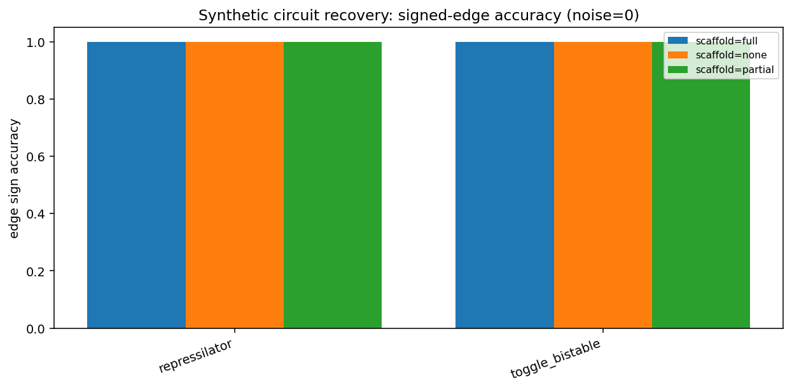

Signed-edge accuracy on synthetic circuits (toggle switch, repressilator, ...) at
zero noise. With the correct scaffold, recovery is essentially perfect
(edge-sign accuracy ≈ 1.0, edge correlation ≈ 1.0).

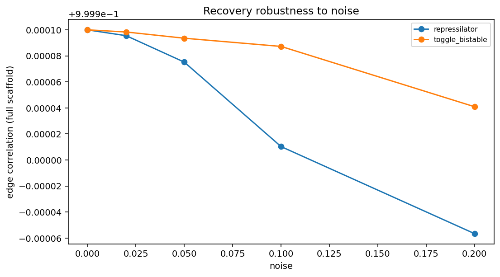

Recovery degrades gracefully as noise is added.

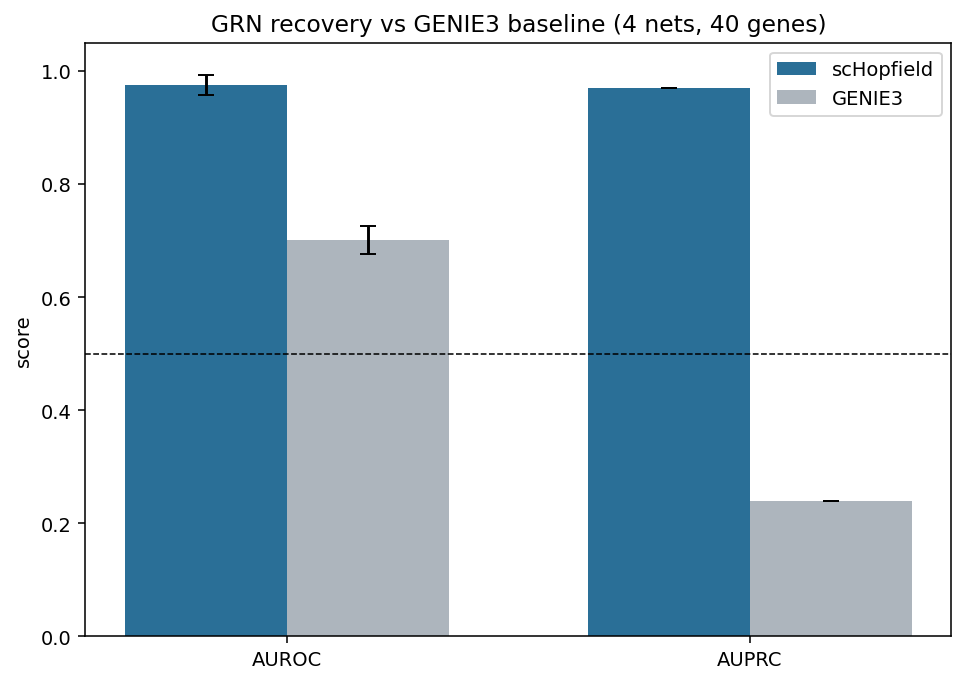

Against a **GENIE3** (ExtraTrees) baseline on the same synthetic networks,
scHopfield reaches **AUROC ≈ 0.98 / AUPRC ≈ 0.97** vs GENIE3's **0.70 / 0.24** — the
dynamical model uses the velocity signal GENIE3 ignores. Paper panels: `fig2`,
`fig2b`, `supp_genie3`.

---

## 3. The Hill nonlinearity is necessary (Fig 3)

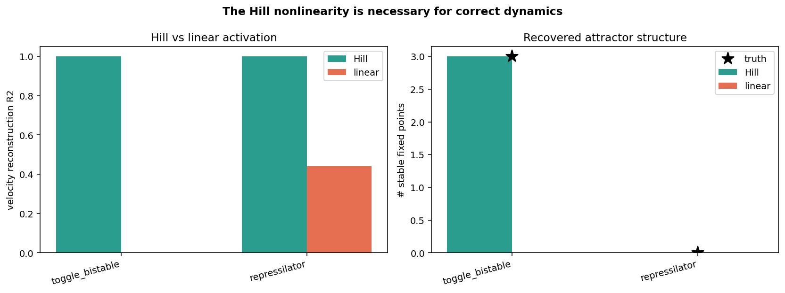

Replacing the Hill activation with a linear one destroys the model: velocity
reconstruction R² collapses (1.0 → ~0 on the toggle) and the recovered attractor
structure is wrong (a bistable toggle needs 3 stable fixed points; the linear model
finds 0). The nonlinearity is not cosmetic. Paper panel: `fig3`.

---

## 4. Known-driver KO validation vs CellOracle (Fig 4)

**Ground-truth-anchored test:** does a single-gene KO shift cells in the *direction*
literature expects?

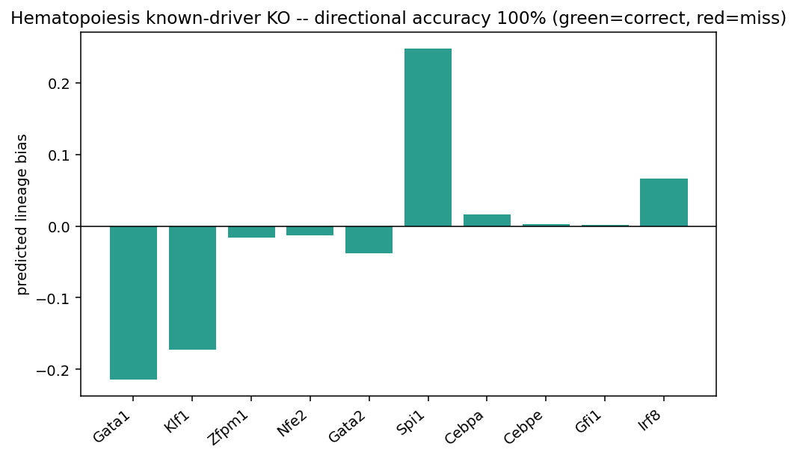

Hematopoiesis (Paul 2015): erythroid masters (Gata1, Klf1, ...) knocked out bias
toward myeloid and vice versa — **directional accuracy 100%** across the panel,
matching the CellOracle protocol on the same data.

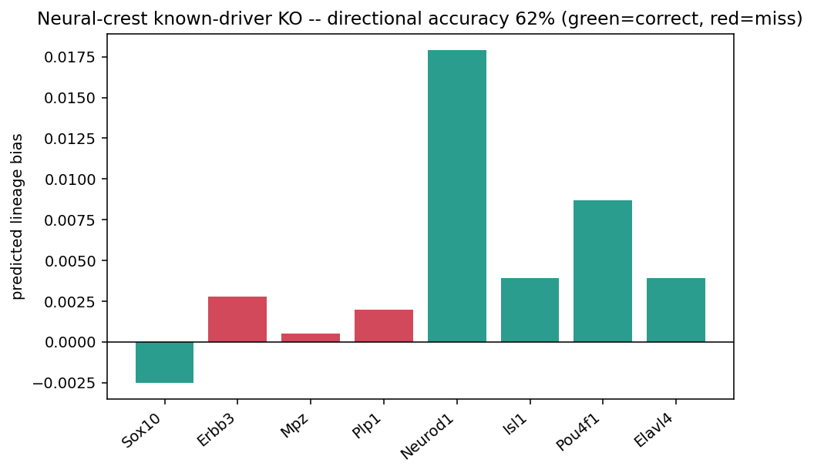

Neural crest (second system): **4/4 for bona-fide TFs**, 5/8 for the full panel; the
misses are non-TF genes (a receptor and myelin structural proteins) with near-zero
predicted effect — an honest, expected limitation. Paper panel: `fig4`.

---

## 5. Robustness / network + regularization sensitivity (Fig 5)

How do the top score/perturbation genes depend on the base GRN and the scaffold
regularization? This section has its own 23-plot guide:

**→ [network_reg_sensitivity/FIGURE_GUIDE.md](network_reg_sensitivity/FIGURE_GUIDE.md)**

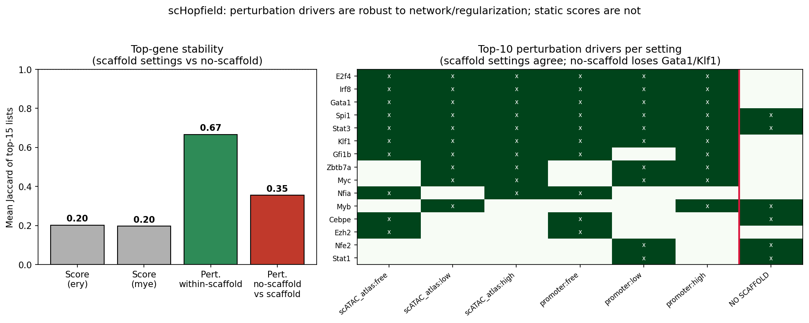

Summary: the driver rankings are stable across networks and regularizations, and
the scaffold-free ("free") fit diverges from all scaffolded fits. Paper panels:
`fig5`, `supp_sensitivity`.

---

## 6. Energy / stability and higher-order predictions (Fig 6)

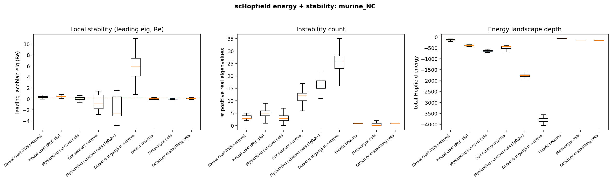

Per-cluster energy depth and Jacobian stability: progenitors sit at higher energy
and are locally unstable (positive leading eigenvalue), terminal states sit in
deeper wells and are stable. The `pancreas/` and `pipeline/` runs reproduce this
ordering across systems. Paper panel: `fig6`.

---

## S. Reproducibility

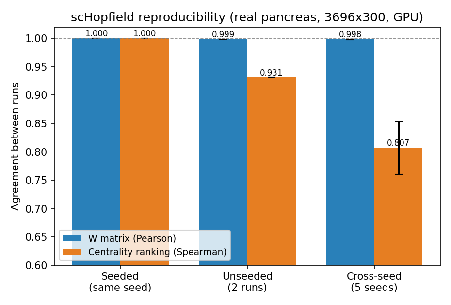

Seeded fits are bit-for-bit reproducible; across seeds the interaction matrix `W` is
highly correlated. Unseeded runs differ, so seeding matters and is now threaded
through the pipeline. Paper panel: `supp_repro`.

---

## S. Identifiability (why the scaffold is needed)

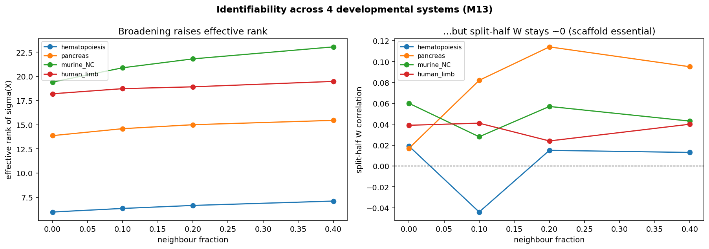

Across 4 developmental systems: adding off-manifold neighbour cells raises the
effective rank of `σ(X)` (left), but the split-half correlation of the
unconstrained `W` stays ~0 (right) — the data is intrinsically too low-rank to
identify `W` without a prior. This is the quantitative case for the scaffold. Paper
panels: `supp_identifiability`, `supp_multi_ident`.

---

## Model: the bias term (L1)

A dedicated study of the bias penalty (why L2 lets the bias take over, why L1 is the
fix, synthetic recovery, and a real reprogramming validation):

**→ [bias_penalty/BIAS_FIGURE_GUIDE.md](bias_penalty/BIAS_FIGURE_GUIDE.md)**

---

## End-to-end pipeline (all datasets)

The reproducible one-call pipeline run across 5 developmental systems, with fitted
data + figures per dataset:

**→ [pipeline/README.md](pipeline/README.md)**

---

## Honest negative: Jacobian-consistency regularizer

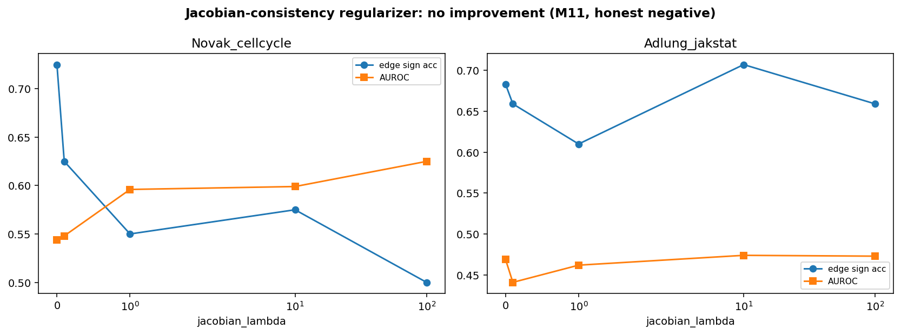

We tried a Jacobian-consistency term (pulling the model's local sensitivity toward a
neighbour-estimated data Jacobian). On the biophysical circuits it did **not** improve
effective-GRN recovery at any strength — reported honestly, and the option is off by
default. The effective identifiability fixes remain broad data coverage and the
scaffold prior.
