# Bias-term penalty: figure guide

The Hopfield model fits velocity as `v = W·σ(x) − γx + I`. The bias `I` is a free
per-gene intercept, confounded with `W·σ(x)` (σ is near-constant within a cluster),
so without a penalty it absorbs the mean velocity and its energy blows up. We want
`I ≈ 0` under natural GRN control but large on genes under a real external input,
which is a **sparsity** requirement → **L1 (lasso)**. These figures test that
(FINDINGS M16 synthetic; M18 reprogramming). All results are on CPU/GPU-agnostic
fits; see `analyses/bias_penalty_*.py` and `analyses/bias_reprogramming_*.py`.

---

## Part 1 — Synthetic recovery (M16)

Controlled test: use real pancreas `σ(x)`, inject a **known sparse ground-truth
bias** into 6 of 60 genes, regenerate velocity, and refit with each penalty.

### Headline: recovered bias per gene
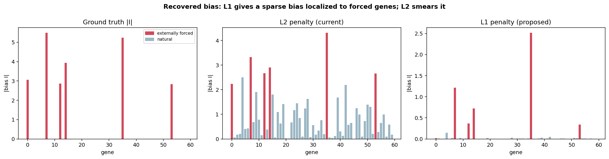

Ground truth (left) has 6 spikes. **L2 (middle) smears the bias across every gene**
(non-forced genes reach half the forced magnitude). **L1 (right) recovers clean
spikes on the forced genes and ~0 everywhere else** — exactly the target behavior.

### A. Metrics vs penalty strength
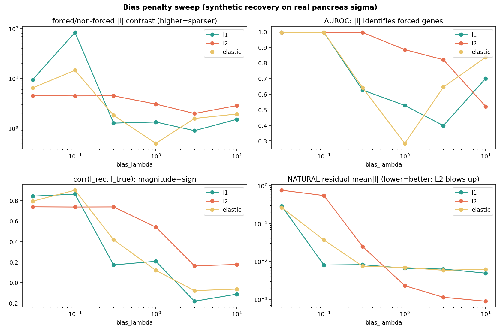

Four readouts across the `bias_lambda` sweep. **Contrast** (forced/non-forced |I|)
is far higher for L1. **AUROC/corr** (identifying/quantifying the forced genes) are
comparable. The critical panel is **natural residual** (bottom-right): at the low λ
L2 needs to catch the forced bias, L2's residual **blows up** (bias takeover),
while L1 stays tiny at every λ.

### B. The "does both" trade-off
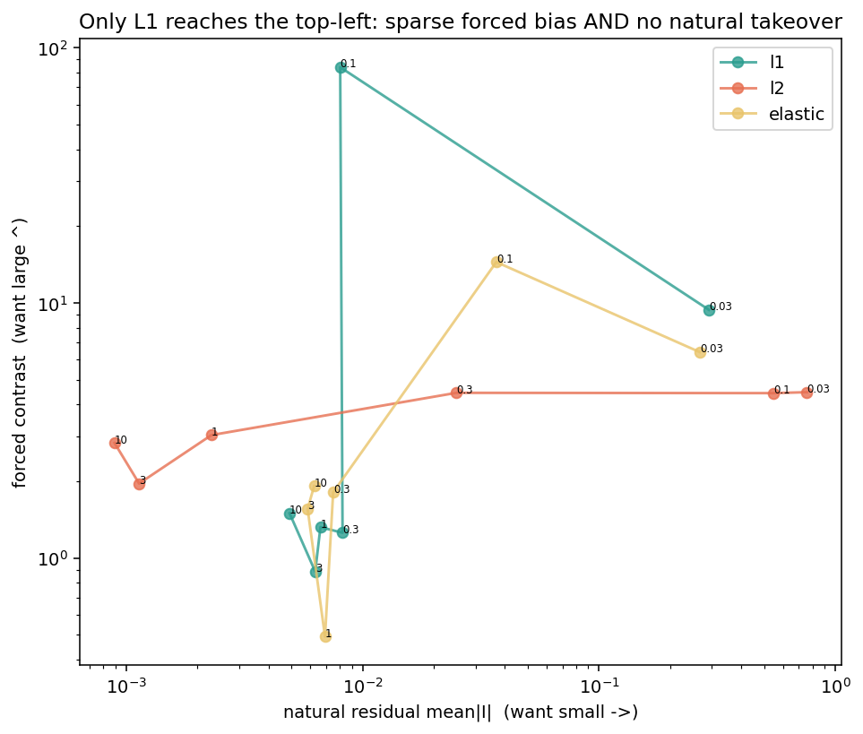

Each point is a (penalty, λ). The ideal is **top-left**: large forced contrast AND
small natural residual. **Only L1 reaches it** (at λ≈0.1). L2 can be sparse-ish or
non-takeover but never both at one λ. This is the core argument for L1.

### C. Per-gene recovery, all penalties
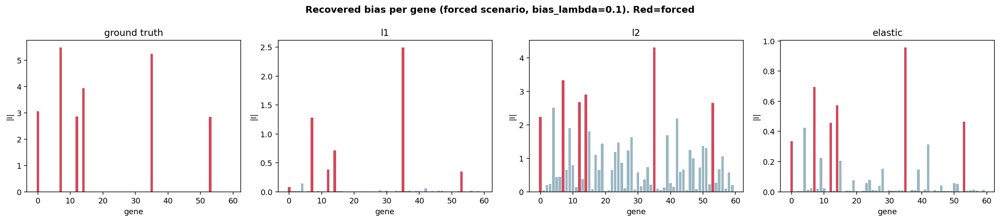

Same as the headline but including elastic-net. Red = forced genes. L1 is the
sparsest; elastic is intermediate; L2 is diffuse.

### D. Recovered vs true bias
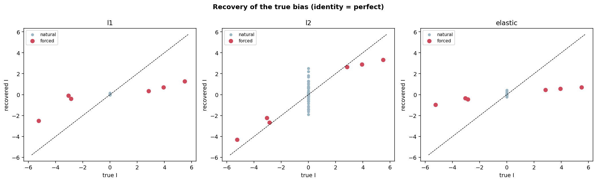

Scatter of recovered vs true `I` (identity line = perfect). Forced genes (red) land
near the diagonal for L1/elastic; L2 compresses them and inflates the natural genes
(gray) off zero.

### E. Non-forced bias distribution
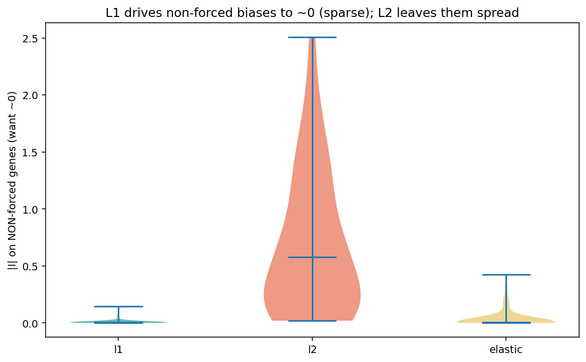

Distribution of |I| on genes that should have **zero** bias. L1's mass sits at ~0;
L2 spreads it out — the smearing, quantified.

### F. Sparsity curve
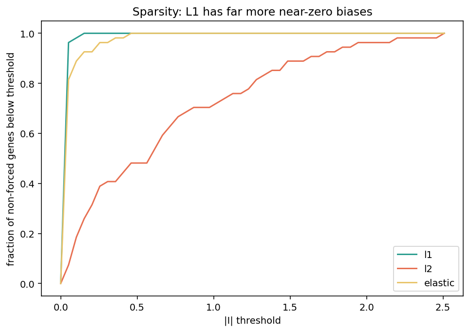

Fraction of non-forced genes with |I| below a threshold. L1 rises fastest → far
more genes are exactly ~0.

**Takeaway (M16):** L1 is λ-robust and produces the desired sparse bias (contrast
~80× vs ~5× for L2). It is now the default `bias_penalty`; `l2`/`elastic` remain.

---

## Part 2 — Real-data validation on reprogramming (M18)

MEF→iPSC reprogramming is driven by exogenous dox-OSKM (Pou5f1, Sox2, Klf4, Myc):
an external input the endogenous network can't produce, so `I ≈ γx − Wσ > 0` on
those genes. Velocity from a DPT pseudotime rooted at a day-0 MEF; bias fit per
stage (MEF → transitional → iPSC).

### Headline: bias per gene, per stage
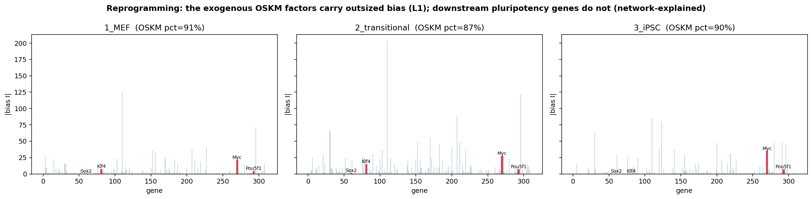

OSKM (red) carry outsized bias in every stage; downstream pluripotency genes do
**not** (they turn on *through* the network, so `W` explains them).

### G. OSKM percentile vs a random null
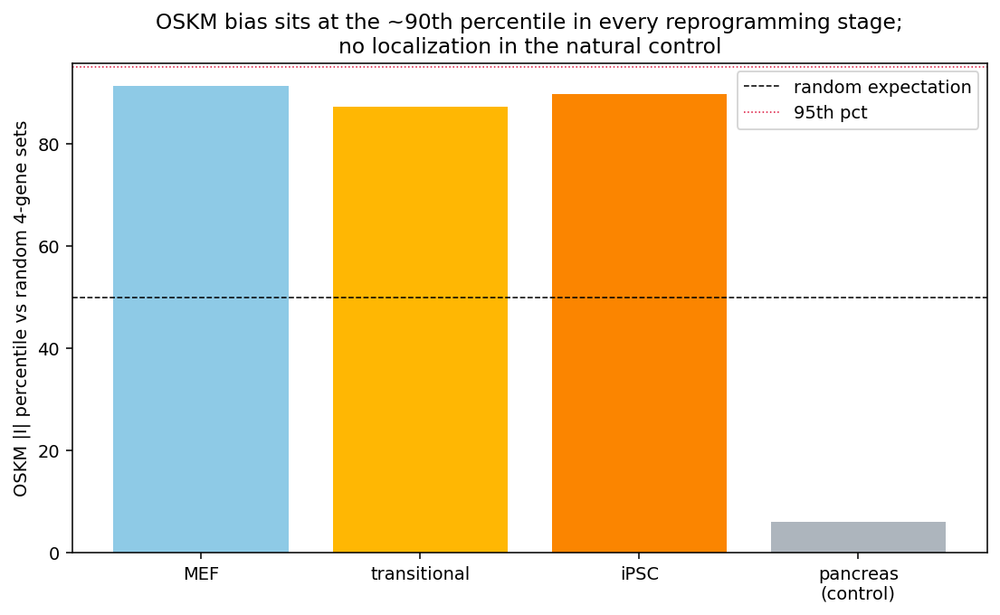

OSKM |I| sits at the **~87–91st percentile** of random 4-gene sets in every
reprogramming stage, versus the **~6th percentile** for random genes in the natural
pancreas control. The bias localizes to the forced factors, and only when forcing
exists.

### H. OSKM vs the rest of the genome
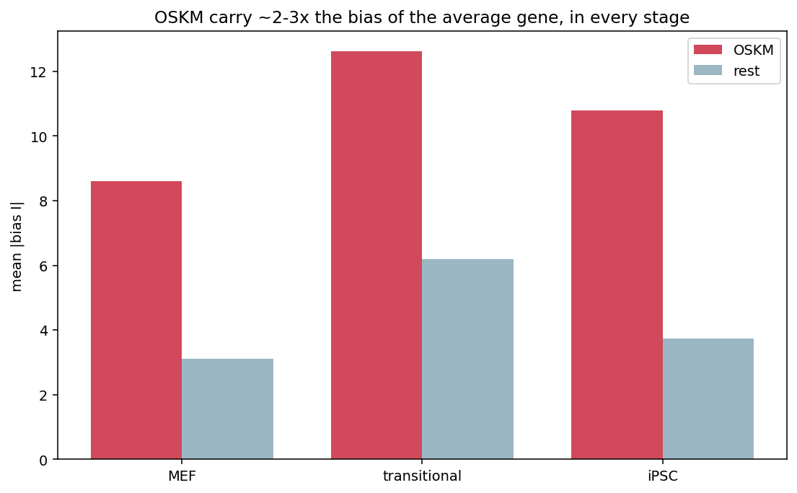

OSKM carry ~2–3× the bias of the average gene, consistently across stages.

### I. OSKM against the null distribution
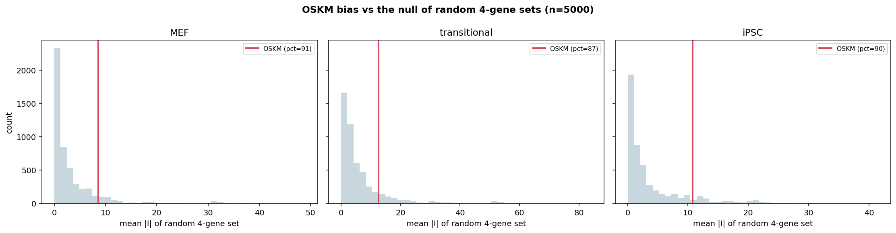

The observed OSKM mean |I| (red line) against the histogram of random 4-gene sets.
Above the bulk in all stages (p ≈ 0.09–0.13; limited power with only 4 factors).

### J. Per-factor bias
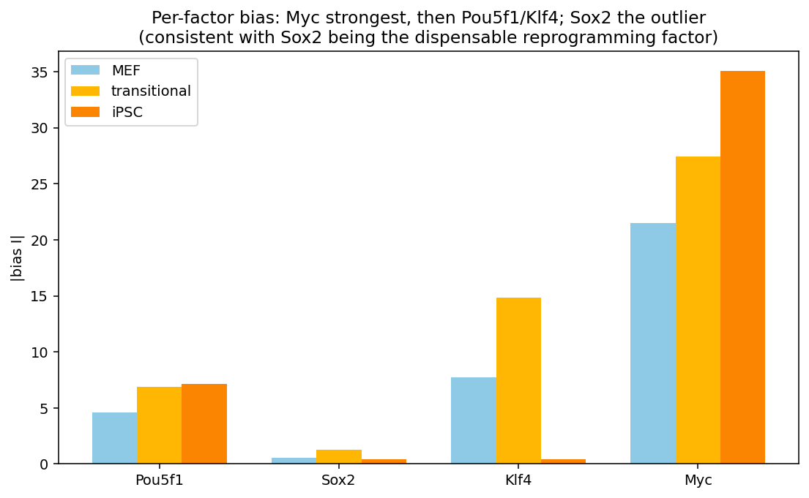

**Myc** is strongest, then **Pou5f1/Klf4**; **Sox2** is the outlier — consistent
with Sox2 being the most dispensable/variable reprogramming factor.

### K. Ranked bias per stage
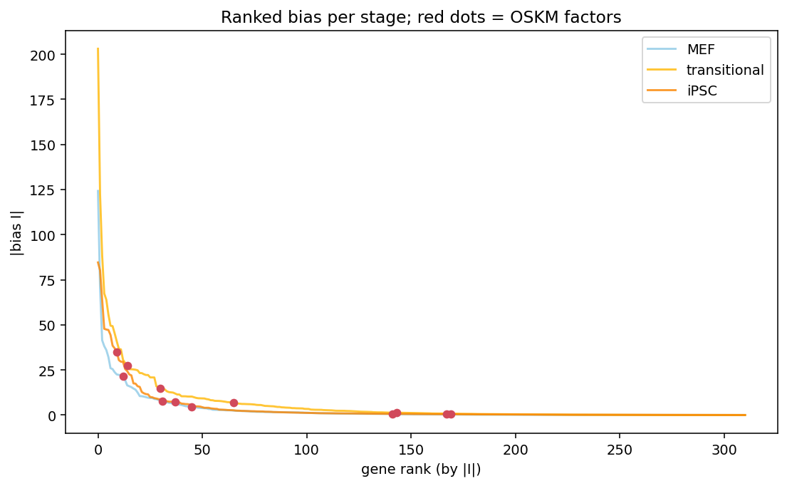

The full |I| rank curve per stage with OSKM marked (red). OSKM are in the upper tail
but not the absolute top — a supportive trend, honestly not a p<0.05 result.

**Takeaway (M18):** on real reprogramming data the L1 bias captures the exogenous
OSKM forcing (and only the forcing, not the network-driven program). Directionally
consistent with the synthetic result; the limiting factor is the crude time-axis
velocity (no spliced/unspliced). A forced dataset with real RNA velocity would
sharpen it to significance.
