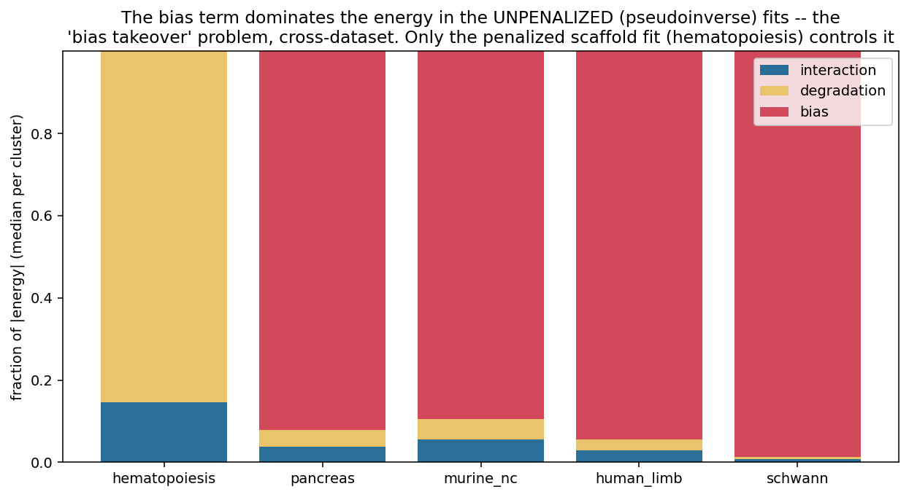
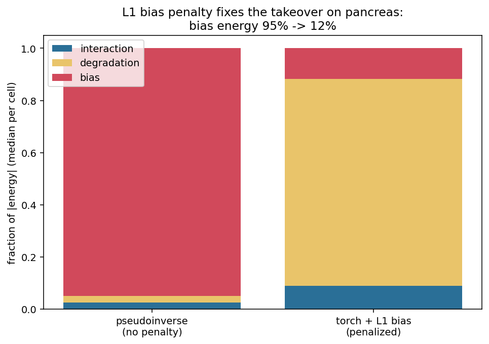
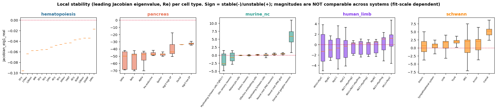
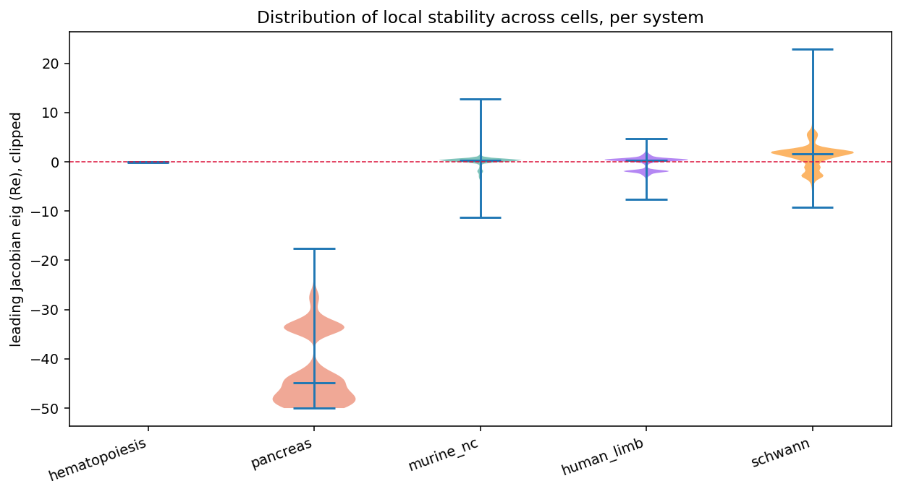
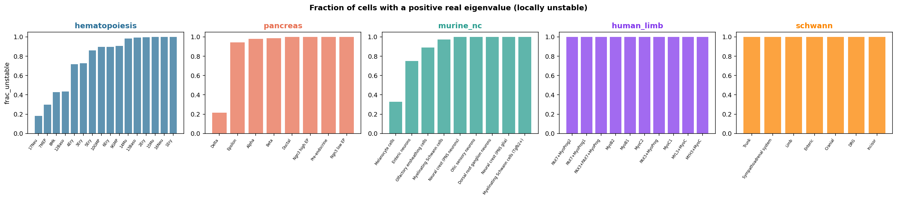
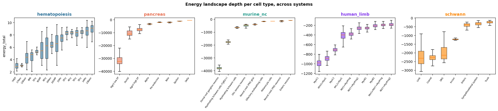
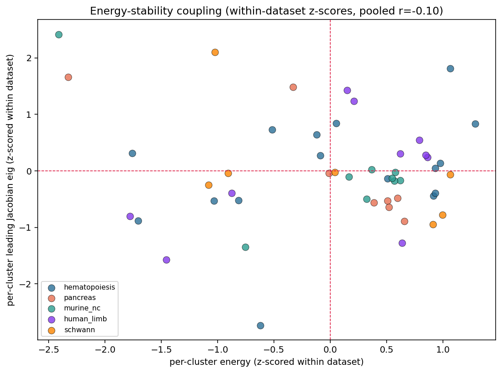
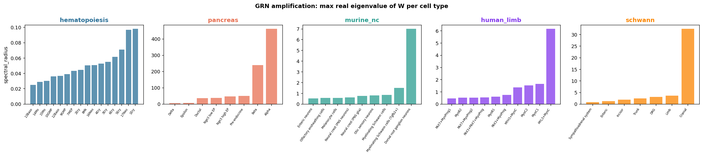
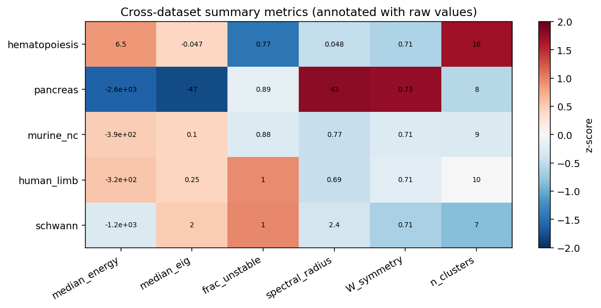

# Cross-dataset results: figure guide

Exploratory results pooled across the **5 fitted developmental systems**
(hematopoiesis, pancreas, murine neural crest, human limb, Schwann), read directly
from `benchmark_results/pipeline/<dataset>/adata_fitted.h5ad` — no re-fitting. See
`analyses/cross_dataset_figures.py`. Per-cluster summaries are in
`cross_dataset_summary.csv`.

**Read this caveat first.** Four of the five datasets were fit by *pseudoinverse*
(the pipeline default when no scaffold is given); hematopoiesis used the *penalized
scaffold* fit. Those are different estimators, so absolute **energy and eigenvalue
magnitudes are not comparable across systems** — only signs, within-dataset
orderings, and fractions are. That difference is itself the most interesting result
here.

---

## The headline: the bias term takes over the unpenalized fits

The Hopfield energy splits into interaction, degradation, and bias terms. In the
**pseudoinverse fits (no bias penalty)** the **bias term dominates the energy:
pancreas 92%, murine NC 90%, human limb 94%, Schwann 99%**. In the **penalized
scaffold fit (hematopoiesis)** the bias is ~0% and degradation carries the energy.
This is exactly the "bias takes over" pathology that motivated the bias study
([bias guide](../bias_penalty/BIAS_FIGURE_GUIDE.md)), now visible across five real
systems: a free intercept with no penalty absorbs the signal.

**The fix, demonstrated on pancreas:** re-fitting the same data with the penalized
torch optimizer + **L1 bias** collapses the bias energy from **95% → 12%** while
reconstruction is preserved. L1 is now the default penalty (see
[FINDINGS](../FINDINGS.md) M16–M18).

---

## Local stability across systems

Leading Jacobian eigenvalue (Re) per cell type. **Sign** is comparable (negative =
locally stable, positive = unstable); magnitude is not. The structure is
heterogeneous: hematopoiesis and pancreas are uniformly stable, whereas Schwann and
several neural-crest / limb states have positive leading eigenvalues (unstable). Some
of this reflects genuine biology (progenitor-like instability) and some the
pseudoinverse fit scale — hence the honest caveat.

The full per-cell distribution of the leading eigenvalue per system (clipped for
display). Pancreas/hematopoiesis sit well below zero; Schwann straddles it.

Fraction of cells with at least one positive real eigenvalue, per cell type — a
sign-based (scale-free) instability readout.

---

## Energy and its coupling to stability

Per-cell-type energy depth. Within each system, terminal/committed states tend to
sit in deeper wells; absolute depths differ by fit scale.

Energy vs leading eigenvalue, **z-scored within each dataset** so the scales are
comparable. Pooled across systems there is a weak/modest relationship between
relative energy and relative stability.

---

## GRN structure across systems

Largest real eigenvalue of the interaction matrix `W` per cell type (a measure of
GRN amplification). Again scale-dependent across fits, but informative within a
system.

A compact summary: datasets × metrics (median energy, median leading eig, fraction
unstable, spectral radius, W symmetry, #clusters), z-scored across datasets and
annotated with the raw values.

---

## What should go in the results

- **Strongest, robust, novel:** the **bias-takeover** finding (composition + the
  pancreas fix). It is scale-free (fractions), reproduced across five systems, and
  directly motivates the L1 default. This is a paper-worthy panel.
- **Supportive with caveats:** the stability sign structure (uniformly stable vs
  mixed) and the within-dataset energy–stability coupling.
- **To make the magnitude comparisons rigorous**, the whole panel should be re-fit
  with one estimator (penalized L1) so energies/eigenvalues share a scale. That is a
  GPU job; deferred while the GPU is occupied.
