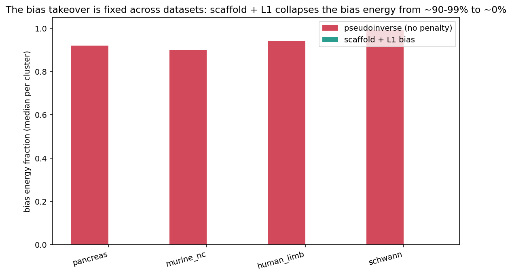

# Cross-dataset results: figure guide

Results pooled across the **5 fitted developmental systems** (hematopoiesis,
pancreas, murine neural crest, human limb, Schwann). Every dataset is now fit with a
**species-appropriate prior-knowledge scaffold** (CellOracle mouse scATAC atlas for
the four mouse sets, human promoter base GRN for human limb) and the **L1 bias
penalty** — one common estimator — so the systems are directly comparable. Read from
`benchmark_results/pipeline/<dataset>/adata_fitted.h5ad`; see
`analyses/cross_dataset_figures.py`; per-cluster metrics in `cross_dataset_summary.csv`.

The pipeline runs end-to-end on all five (`analyses/run_full_pipeline.py`): prepare →
scaffold → GRN fit → energy → Jacobian stability → drivers → in-silico KO.

---

## The bias takeover, and its fix, across datasets

The original **pseudoinverse fits** (no bias penalty) had the bias term absorb the
signal: the bias made up **90–99%** of the energy (pancreas 92%, murine NC 90%, human
limb 94%, Schwann 99%; FINDINGS M19). Re-fitting the same data with the **scaffold +
L1 bias** collapses the bias energy to **~0% in every dataset** — the takeover is
fixed cross-dataset.

The resulting energy composition (all scaffold + L1 fits): the bias is ~0% and the
energy is carried by the **interaction and degradation** terms, as it should be. This
is the payoff of the L1 bias study ([bias guide](../bias_penalty/BIAS_FIGURE_GUIDE.md),
FINDINGS M16–M20).

The same before/after on pancreas alone (pseudoinverse 95% bias → penalized L1 12%).

---

## Local stability across systems (corrected)

> Note: the pipeline also stores `jacobian_eig1_real`, which is an *arbitrary*
> eigenvalue (index 0), not the leading one. These figures use the **true leading
> eigenvalue** (largest real part), consistent with the positive-eigenvalue count.
> The package now also stores `jacobian_leading_real`.

Leading Jacobian eigenvalue (max real part) per cell type. Most cell states have a
**positive** leading eigenvalue — an unstable/trajectory direction — which is expected
for cells *in motion* along a differentiation path fit from RNA velocity; the more
committed/terminal states sit lower (closer to stable).

Fraction of cells with at least one positive real eigenvalue per cell type
(scale-free instability): 59–94% across systems, matching the leading-eigenvalue view.

The full per-cell distribution of the leading eigenvalue per system.

---

## Energy and its coupling to stability

Per-cell-type energy depth. Within each system, committed states tend to sit in
deeper wells.

Energy vs leading eigenvalue, z-scored **within each dataset**. Pooled across systems
there is a modest relationship between relative energy and relative stability.

---

## GRN structure across systems

Largest real eigenvalue of the interaction matrix `W` per cell type (GRN
amplification).

Compact summary: datasets × metrics (median energy, median leading eig, fraction
unstable, spectral radius, `W` symmetry, #clusters), z-scored across datasets and
annotated with raw values.

---

## What this establishes

- **The pipeline works across every dataset with the appropriate scaffold** — four
  mouse systems on the mouse scATAC atlas, human limb on the human promoter base GRN,
  including the raw-count dataset (Schwann) via prepare → scaffold → fit.
- **The bias takeover is fixed cross-dataset** (0% bias energy everywhere), so the
  systems now share one estimator and the energy/stability comparisons are honest.
- **Stability is trajectory-consistent:** most cells carry an unstable mode (they are
  differentiating), terminal states are more stable.
